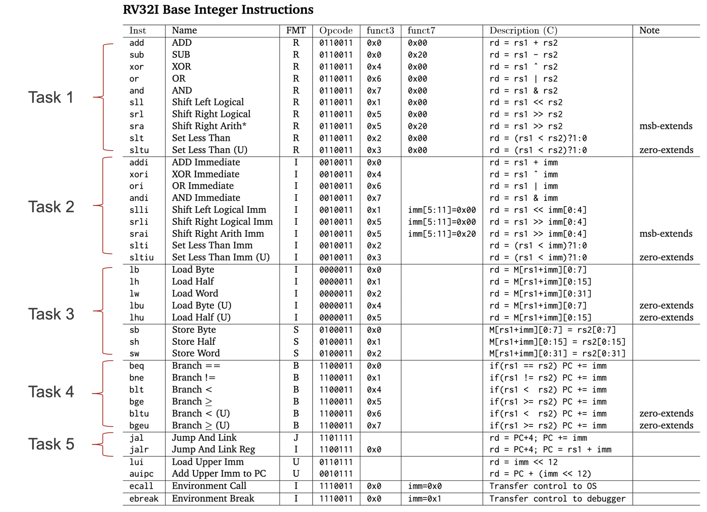

# [Lab 1] Single-Cycle CPU Implementation

## Introduction

The goal of this lab is to implement a simple, single-cycle CPU (**RISC-V** processor based on **RV32I**) using Verilog HDL. To do so, you will need to complete the following tasks one by one.

- Task 1: Complete the microarchitecture (uarch) for **arithmetic (R-Type)** instructions
- Task 2: Implement uarch for **immediate arithmetic (I-Type)** instructions
- Task 3: Implement uarch for **load (I-Type) & store (S-Type)** instructions
- Task 4: Implement uarch for **branch (B-Type)** instructions
- Task 5: Implement uarch for **jump (J/I-Type)** instructions

We provide you with an *almost complete* R-Type implementation, which you need to build on. We also provide you with the test code for each task.

## RV32I Base Integer Instructions & Tasks



## Project Repository

The project repository includes the following contents.

```
Top (project directory)
├── src
├── data
├── docs
├── test.py
└── Makefile
```

- **src** directory
    - **modules** directory: source code for the modules that ***you will need to implement*** 
    - **simple_cpu.v**: source code for the simple CPU that ***you will need to implement***
    - **riscv_tb.v**: test bench to test out your simple CPU
- **data** directory
    - **task#** and **fib** directories: test cases
        - **inst.txt**: assembly code for the task
        - **inst_disassembled.mem**: machine code for the task
        - **reg_in.mem**: initial register values *before* executing the instructions
        - **reg_out.mem**: correct register values *after* executing the instructions
- **docs** directory: the simple CPU diagram and descriptions for each module; RISC-V specifications
- **test.py**: a script to run simulations and compare the results with the correct ones 
- **Makefile**: makefile to compile your code

## How to Compile, Run, and Test Your Code

> Unless otherwise specified, the working directory is your project directory.

### Compile Code

To compile your code, you need to run `make` in your project directory. This will compile all the Verilog code including the test bench (`riscv_tb.v`) and generate a `simple_cpu` binary file, which you can execute for simulations. 

```
$ make
```

Note that whenever you modify the code, you need to recompile your code via ``make``.

### Run Simulation

After building the binary, you can simply run simulations with the following command. 

```
$ ./simple_cpu
```

By default, this reads the instructions and initial registers from `data/inst.mem` and `data/register.mem`, and runs simulations using `riscv_tb.v`. At the end of the simulation, it will display some information on the instruction memory, PC, register file, and data memory. Please check with `riscv_tb.v` to see how it displays the information. You may want to modify these files for `debugging purposes`. This will also dump the waveforms of your simulation into `sim.vcd`.

You can ignore the following warning message.
```
WARNING: src/simple_cpu.v:40: $readmemb(data/inst.mem): Not enough words in the file for the requested range [0:63].
```

### Run Test Cases

We provide you with `test.py` to automatically run simulations and compare the output with the correct register values for the following test cases.

- Task 1 (2 tests): Arithmetic (R-Type)
- Task 2 (2 tests): Immediate Arithmetic (I-Type)
- Task 3 (2 tests): Load (I-Type) & Store (S-Type)
- Task 4 (1 test): Branch (B-Type)
- Task 5 (1 test): Jump (J/I-Type)
- Final Task (1 test): Fibonacci sequence

You can run all the tasks by executing the following command.

```
$ python test.py
```

This will output the results on your terminal. **The code that we provided you with should successfully run task1/1** before you complete Task 1. 

```
[*] test start
starting test task1/1
your register values should be
[0, 1, 2, 3, 4, 5, 6, 7, 8, 9, 10, 11, 12, 13, 14, 15, 3, -4, 6, 7, 1, -5, 0, 0, 0, 0, 0, 0, 0, 0, 0, 0]
your verilog register values are
[0, 1, 2, 3, 4, 5, 6, 7, 8, 9, 10, 11, 12, 13, 14, 15, 3, -4, 6, 7, 1, -5, 0, 0, 0, 0, 0, 0, 0, 0, 0, 0]
test passed
-------------------------------
starting test task1/2
your register values should be
[0, 1, 2, 3, 4, 5, 6, 7, 8, 9, 10, 11, 12, 13, 14, 15, -20, 16, 1073741822, 1, -2, 1, 1, 0, 1, 1, 1, 0, 0, 0, 0, -5]
your verilog register values are
[0, 1, 2, 3, 4, 5, 6, 7, 8, 9, 10, 11, 12, 13, 14, 15, 0, 0, 0, 0, 0, 0, 0, 0, 0, 0, 0, 0, 0, 0, 0, -5]
test failed
-------------------------------
starting test task2/1
...
```

If the command above does not work, read the 'Caution ⚠️' section.

## How to Start?

* Before you start implementing, you may want to first complete the datapath in the simple CPU diagram. Make sure you understand what each signal/port means and connect them accordingly. This will help debug your design when it does not work as expected.
* To do so, **PLEASE** draw wires & MUXs at `docs/Single-Cycle-CPU-Diagram.pdf` appropriately and **SUBMIT** it too.
* You need to understand the **exact** semantics of each instruction by reading the lecture slides, RISC-V specifications, and textbooks.
* Look at the skeleton code to understand how the code provided implements task1/1.
* Start early, post your questions on eTL, and enjoy debugging. :)

## Caution ⚠️ 

* Because the test code relies on the pre-defined directory structure and file names, please try not to change the locations of the files. In case you want to change the directory structure, you should change the test code too!
* `test.py` may fail to execute if you do not have `Python 3` installed. Run the following command to see if you have it.

```
$ python --version
Python 3.8.5
// Or
$ python3 --version
Python 3.8.5
```

* If it shows 'Python 3.#.#', run the following command instead of `python test.py`

```
$ python3 test.py
```

* If it does not show 'Python 3.#.#', you should install Python 3 (not Python 2).
    * WSL: Do ``sudo apt update && upgrade`` and ``sudo apt install python3 python3-pip ipython``. 
    * Ubuntu 18.04 & before: Do ``sudo apt update``,
    ``sudo apt install software-properties-common``,
    ``sudo add-apt-repository ppa:deadsnakes/ppa``, 
    ``sudo apt update`` and
    ``sudo apt install python3.8``.
    * macOS & Ubuntu 20.04: Python 3 is pre-installed, so there should be no errors when executing `test.py`.

## Submission

#DUE: **4/17 (THU) 11:59PM**

### Late Policy (**3 Days**)
* 20% discounted per day (4/18 12:00 AM is a late submission) 
* After 4/21 (MON) 12:00AM, you will get a **zero** score for the assignment

### What to Submit
*  Your code that we can compile and run
*  Submit all the files/directories (do `make clean` first)

*  Completed 'Single-Cycle-CPU-Diagram' (**Do not forget!!**)

### How to Submit
* Upload your compressed file (zip) to eTL
* Format: **YourStudentID_YOURLASTNAME_lab#**
	* e.g., 2025-12345_KIM_lab1.zip
* Please make sure you follow the format 
	* **10% penalty** for the wrong format

## Honor Code

**SIMPLE.** **DO NOT CHEAT!**

* This is an **individual** project. You may discuss high-level concepts with other students, but you should implement your code **all by yourself**. 
* **DO NOT POST ANY CODE IN PUBLIC** including the skeleton code and your implementations.
* We use very sophisticated tools for detecting code plagiarism (not relying on eTL). 
* All the students who get involved in violation will get a zero score for the assignment. If it is serious, there will be department-wise actions.

## Lab Announcement

* If there is any revision for this lab, we will announce it over this [repository](https://github.com/SNU-Comparch-Classes/comporg_announcement_2024).
